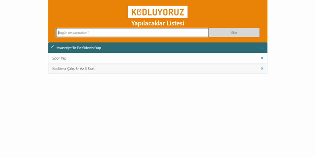

# TODO APP | [Kodluyoruz.org](https://www.kodluyoruz.org/)

## TODO APP - Frontend Bootcamp Homework

In this project, you'll learn:
- Create DOM element
- Using LocalStorage
- Check DOM Element
- Using Alert Function

### Project Requirements
---
1. Create input and add button on HTML page.
2. Give 'id' your elements for all DOM functions.
3. Create List Add Function
4. Create Delete function for all added elements.
5. Create check function.
6. Add LocalStorage and Alert Function.

### View Project
---
[Live Demo](https://emrahsusam.github.io/Hello-Clock/) of this project for review.

